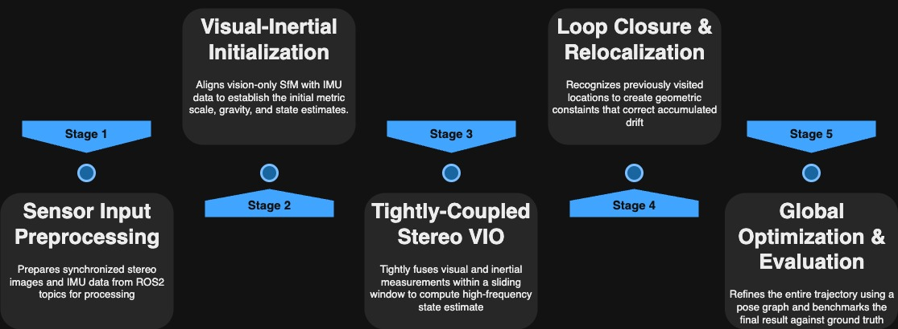
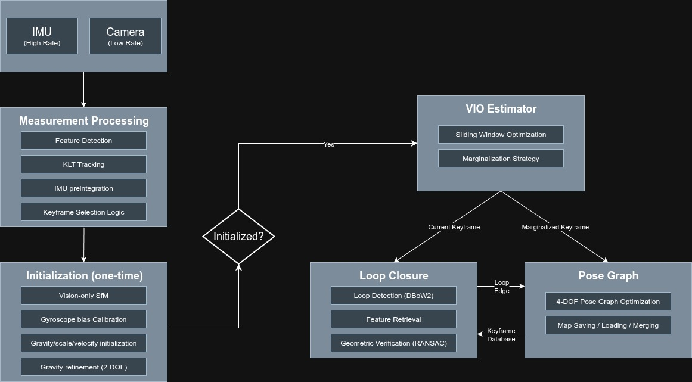

# Visual-Inertial-Odometry
## What it does
Augmenting the VINS-Fusion algorithm with learning-based Feature Selection and Adaptive NMS

## Workflow
This project follows a 5-step workflow: Data Input, Initialization, Stereo VIO, Loop Closure, and Global Optimization.

## System Architecture

## How I built
I implemented a five-step ROS2 pipeline based on VINS-Fusion to process sensor data and generate an optimized trajectory for evaluation.

## What I learned
I learned the fundamentals of visual-inertial sensor fusion, the importance of loop closure in reducing drift, and how to benchmark VIO systems.

## Measure ROS2 Bag play topic freq rate
`
ros2 topic hz /cam0/image_raw
`